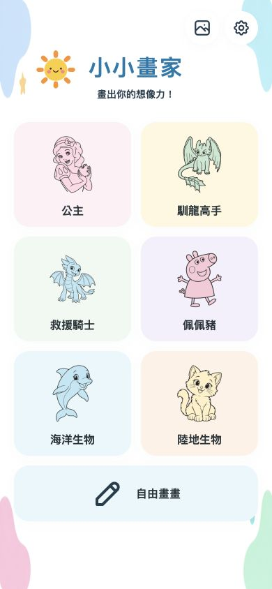
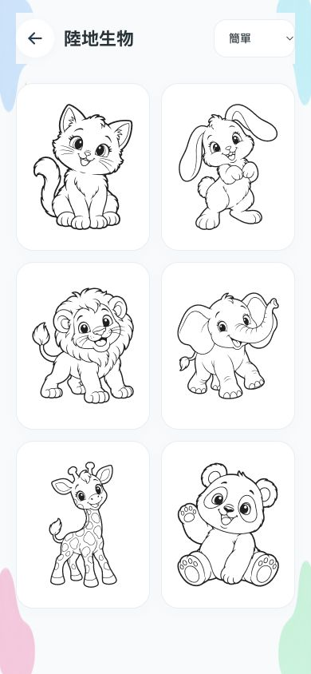
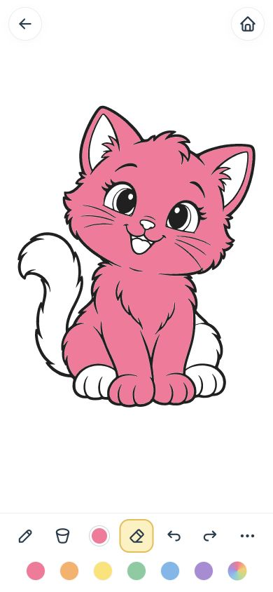

# 小小畫家 UI 規格書

版本：V12 · 2026-10-06 · 設計方向：樣板 2「簡約童趣風」

本文件描述本次已實作的介面。參考為使用者提供的三組樣板中間欄及 UI 說明文件；實際內容沿用現有公主、馴龍高手、救援騎士、佩佩豬、海洋生物、陸地生物六分類。參考中的交通工具、太空、食物等分類不以空卡片代替，待有內容再新增。

## 1. 使用對象與核心流程

主要使用者為約 3–6 歲兒童，優先手機手指操作；家長可使用平板、桌機選圖與下載作品。無登入、廣告、付費顏色或解鎖步驟。

流程：首頁 → 分類 → 點線稿 → 畫畫。首頁也可直接開空白畫布。畫畫頁左上返回目前分類，右上回分類首頁。選圖頁顯示實際縮圖，不讓兒童先閱讀說明。

## 2. 視覺與設計 token

白色畫布、柔和淡色卡片、深色文字、大圓角、輕量陰影。裝飾只在首頁及寬螢幕畫布周圍，不畫進作品，也不阻擋觸控。

| Token | 色碼 | 用途 |
|---|---|---|
| white | `#FFFFFF` | 畫布、線稿卡、彈出選單 |
| background | `#F7FAFC` | 分類頁、一般輔助背景 |
| text | `#263238` | 主要文字 |
| muted | `#607D8B` | 次要資訊 |
| border | `#E8EEF2` | 輕量邊線 |
| accent | `#087BAC` | 標題、鍵盤焦點 |
| pastel-blue | `#BFE7F5` | 淡藍輔助色 |
| pastel-yellow | `#FFE7A3` | 淡黃輔助色 |
| pastel-pink | `#F8C9D8` | 淡粉輔助色 |
| pastel-green | `#C9E8D0` | 淡綠輔助色 |
| active-fill | `#FFF0BD` | 已選工具底色 |
| active-outline | `#E9BD44` | 已選工具輪廓 |

分類卡底色：淡粉 `#FFF0F5`、淡黃 `#FFF7DF`、淡綠 `#EFF9F1`、淡紫 `#F4F0FC`、淡藍 `#E8F7FC`、淡橘 `#FFF2E7`。

字體：`Noto Sans TC` → `PingFang TC` → `Microsoft JhengHei` → sans-serif，使用裝置已有字體，避免離線缺字。主標 32px／寬螢幕 36px／極小手機 28px，粗體；頁標 22–26px；分類名 16px；選單文字 14–15px；寬螢幕工具短標 13px。手機畫畫工具只顯示圖示，保留完整 aria-label。

卡片圓角 22px、画布及 dialog 24px、按鈕 14–16px。卡片陰影 `0 4px 16px rgba(50,80,100,.06)`。按下縮放 `.97`，動畫 120ms；尊重 reduced-motion，無自動漂浮、音效或閃爍。

圖示採 [Tabler Icons](https://tabler.io/icons)，來源授權保留於 `assets/ui/TABLER-LICENSE`。分類插圖沿用現有線稿製作透明淡色預覽；太陽與四角裝飾為另外生成的 PNG。

## 3. RWD 與觸控

| 尺寸／情境 | 首頁分類 | 選圖格數 | 畫畫工具位置 |
|---|---|---|---|
| 手機 <768px | 2 欄；自由畫畫滿列 | 2 欄 | 底部 7 個工具 + 常用色票 |
| 平板 768–1199px | 3 欄，六分類兩列 | 4 欄 | 直向窄螢幕沿用底部；寬 ≥900px 且高 ≥560px 改左右工具列 |
| 桌機 ≥1200px | 3 欄，六分類兩列 | 5 欄 | 左工具、右作品操作、底部常用色票 |
| 橫向且高度 ≤500px | 4 欄，容許頁面捲動 | 4 欄 | 一排底部工具；常用色票收起，顏色按鈕仍可使用 |

首頁外距手機 20px，極小手機 16px，平板 32px，桌機 40px；最大內容宽 1200px，分類卡區最大宽 900px。手機卡片間距 14px，平板及桌機 18px。

觸控尺寸至少 44×44 CSS px；一般圖示按鈕 48×48，寬螢幕工具 64×66。320px 手機縮減按鈕間距與外距，保留 44px 操作面積。所有主要操作可單擊完成，不依賴 hover。

高度使用 `100dvh`；上下保留 safe-area inset。畫畫頁本身不捲動、不選取文字、不啟動長按圖片選單；首頁、分類頁與超高 dialog 可捲動。

## 4. 首頁

頂部右側：作品相簿、設定／資訊兩個圖示按鈕。中央品牌「小小畫家」、副標「畫出你的想像力！」及小太陽；其下六張淡色分類卡。

分類卡：圖像 + 一行短名稱；手機高 150px、平板 176px、桌機 188px。圖片保持比例，不拉伸、不放解鎖狀態、數量標籤或付費標示。自由畫畫為滿列淡藍卡片，筆圖示 + 短名稱。

## 5. 分類／選圖頁

頁首：左返回、分類標題、右難度下拉選單。難度有「簡單」「全部」「細節較多」，預設簡單；切分類重置到簡單。複雜群像、配角較多及繁密髮絲的線稿不預設顯示。

線稿卡白底，長寬比 4:5，內距 12px；以真正 SVG 預覽，不截取畫面截圖。卡片無額外文字，aria-label 和 alt 保留角色名稱。每張卡只開一張可獨立繪畫的紙；移除原「夜煞一家」三張獨立小圖拼版，改為夜煞、光煞、三隻小龍各自的大圖卡。三隻小龍屬同一場景，不是三張縮圖拼版。

沒有該難度內容時显示簡短空狀態，不建立無效卡片。分類頁可捲動；頁首保持可見。

## 6. 畫畫頁

上方左側返回選圖，中間放上一步／下一步，右側依序放清除畫布與回首頁；清除與首頁之間保留 16px 間隔，所有上方按鈕只顯示圖示。手機畫布占滿工具列以外的區域，不加固定白紙比例的外框；寬螢幕畫布保留 24px 圓角，左右讓出 108px 工具空間。

線稿採固定內部坐標 360×440；實際輪廓等比例置中並放到最大 320×396，保留約 20px 安全距。若圖本身橫向，按寬度限制縮放，不拉長成直向。手機或平板旋轉時重排畫布並保存作品，不裁掉已存在的內容。

背景填色覆蓋整張可畫區。圖案保持比例；畫布範圍隨畫面擴展，避免只有中央矩形可畫。

## 7. 工具與操作

| 工具 | 行為 | 狀態／保護 |
|---|---|---|
| 填色 | 點封閉區域上色 | 空白畫布停用；同色不新增復原紀錄 |
| 畫筆 | 點擊開粗細選單；手指拖曳畫線 | 下筆後鎖定起始區域，筆跡不蓋線框 |
| 顏色 | 開常用色、自訂色與彩虹選單 | 工具列顯示目前颜色 |
| 橡皮擦 | 點擊開粗細；只擦觸及範圍 | 著色紙擦回白色，空白紙移除筆跡；不整區清除、不擦線框 |
| 上一步 | 復原目前圖上一個動作 | 空紀錄停用；不切回另一張圖片 |
| 下一步 | 重做目前圖被復原的動作 | 無可重做紀錄時停用；新動作清空重做紀錄 |
| 儲存 | 保存相簿並提供 PNG 下載 | 作品只有本機保存，不上傳 |
| 重新開始 | 清掉這張圖的色彩與筆跡 | 保留線稿；算一次可復原動作 |
| 全螢幕 | 使用瀏覽器 Fullscreen API | 不支援時提示加入主畫面；不隱藏工具 |
| 更多 | 開作品操作選單 | 從更多按鈕旁展開直向小選單：存成圖片、全螢幕、關於畫室；無遮罩及背景模糊，點外面或 Esc 關閉 |

手機工具列常駐 4 個圖示：畫筆、填色、橡皮擦、更多。下方顏色排依序為目前顏色（開選色面板）、六種常用固定色（直接換色）、彩虹筆（直接啟用）。上一步／下一步及清除移至上方。寬螢幕左側放繪畫工具，右側放儲存、全螢幕與更多。

目前沒有蠟筆及貼紙功能，因此不放會讓小孩以為可以用的假按鈕。

## 8. 粗細與顏色

畫筆與橡皮擦各自記住粗細，預設 12 CSS px。提供 5、12、24、40 四個圓點選項；直徑按顯示像素換算到 Canvas 解析度，桌機不因高解析度畫布而意外变大。

底部快速色票：粉、橘、黃、綠、藍、紫；最後一顆開完整選色。完整色盤 15 色，含棕、黑、白；色相、濃淡、明亮可自訂；彩虹筆連續變色。色票選中有輪廓，不只靠顏色判斷。橫向短畫面使用顏色按鈕開此選單。

## 9. 作品與復原

每張圖保存獨立的作品快照、最多 20 步復原與重做紀錄；本次開啟期間換圖後再回來可繼續。復原到最早一步停住，不退回選圖、更不更換圖片。

目前作品自動存 IndexedDB，最近 20 張匯出作品保存在相簿。復原紀錄在本次開啟期間有效，重新開啟網站不保留步驟。相簿作品可下載；清除瀏覽器網站資料會移除本機作品。

## 10. Dialog 與狀態

Dialog 白底、24px 圓角、最大宽 390–440px、最大高 85dvh，超高時只捲動選單；背景輕暗與 3px 模糊。提供至少 48px 關閉按鈕，可點 dialog 外側關閉。

工具選中：淡黃底 + 金黃框。停用：opacity .35。鍵盤焦點：3px 藍框。觸控按下：scale .97，120ms。

載入失敗、存储空間不足或不支援全螢幕時給簡短可見提示，另以 aria-live status 發出訊息。載入失敗保留目前畫作和選圖，不寫入空白快照。下載／儲存成功显示短提示。

重新開始不要求孩子閱讀確認視窗；誤觸可用上一步恢復。

## 11. 線稿內容驗收

- 一张紙是一幅可畫的大圖，不把多張獨立圖縮成拼版。
- 主體盡量達到視圖宽 89% 或高 90%，保留邊距、不扭曲、不裁掉翅膀、頭髮或尾巴。
- 黑線清晰；清除列印邊框、來源文字、頁腳和雜點。
- 需要獨立上色的區域必須封閉；半身圖底部和裁切端點亦要封口。
- 不能因輪廓碰到邊緣就把角色當成背景。
- 填背景後，角色身體、髮絲與尾巴等測試點保持白色；再填角色不改變背景。
- 細小的白區不直接省略成背景；複雜群像只放細節較多篩選。
- 保留原有來源與角色構圖，不能將 tracing 當成重畫角色的品質保證。來源與授權資訊集中於關於畫室及 SOURCES.md。

本次 36 張透過 normalized SVG 種子測試。種子測試覆蓋指定區域，並不等於每個像素或所有內部小區均經人工重畫。

## 12. 技術與路由

現有 HTML／CSS／JavaScript，Canvas 筆跡 + SVG 區域填色；無必要新增 framework 或後端。首頁與分類由本機狀態切換，畫畫頁使用 `#draw`。規劃文件的 `/category/:id`、`/draw/:id` 为未来深連結方向，本版未實作。

靜態部署：GitHub Pages，檔案和素材相對路徑，支援 `/little-art-studio/` 子路徑。Service Worker 預快取 HTML、JS、CSS、全部 SVG、分類縮圖、裝飾與工具圖示；更新在安全的首頁狀態套用，避免畫到一半強制換版。

## 13. 可及性

每個工具都有 aria-label；圖案縮圖有角色名称；裝飾圖片 alt 空白。工具與色票提供 keyboard focus，原生 dialog 可鍵盤關閉，原生難度 select 可鍵盤選取。當前工具有形狀框線提示，不能只靠色相辨識。

至少 44px 觸控區域，文案高對比；繪畫頁少文字。未加入聲音回饋、手勢縮放或高對比專用模式，不在本規格宣稱已支援。

## 14. 驗證與交付

驗證尺寸：320×568、375×667、390×844、768×1024、1024×768、1280×720，以及 844×390 橫向。檢查畫布完整、主要控制無橫向溢出、最小觸控尺寸、完整分類流程、填色、局部橡皮擦、獨立復原、快速色與選色選單。

靜態線稿背景回歸：`tests/svg-background.cjs`，需要 sharp。原繪畫回歸檔與種子資料保留。視覺比較與例外記錄：`design-qa.md`。

後續內容優先補「單一角色、大塊區域、少細節」的圖，再擴分類；不要用增加功能取代線稿品質。

首頁直接顯示內建分類目錄，畫布與上次作品延後至進入編輯器準備。離線快取包含首頁、工具與已載入的著色紙；首次開啟新著色紙需要連網，避免啟動時下載全部線稿。

### V20 著色紙衍生版本

選圖庫共 48 張：原有 36 張與 12 張公主服裝簡化版。簡化版以「角色・簡單版」命名，目錄使用 simpleOf 指向原圖。原圖仍保留細节較多分類，各版本作品與復原歷史獨立。簡化範圍以服裝為主，未宣稱角色已重新繪製或全面消除小區塊。

## V22：公主與馴龍線稿重建（2026-10-06）

15 張公主、5 張馴龍著色紙改用平順曲線 SVG，保留來源角色造型與構圖。移除列印文字、外框及部分獨立裝飾；自動補缺口僅用於隱藏的填色邊界，不顯示額外補線。光煞採完整單隻角色，雙龍圖改成兩隻完整角色的組合。這批是來源線稿的向量重建，並非 20 張全新原創插畫。

舊 SVG 與 easy 版本保留，支援舊作品；選圖介面只呈現新版。群像、珊瑚、密集髮絲等複雜構圖置於細節較多分類。角色原有黑色髮塊等仍保留；不保證每個極小細節都可獨立填色。

驗證：全部 20 張新版逐張渲染檢視；36 張目前選圖皆通過白區背景隔離取樣檢查（容許取樣點周圍 2px 的曲線邊緣偏差）。390×844 手機畫面測試艾莎：背景粉紅、衣服藍色，臉部、手臂與辮子維持白色，復原與還原正常，無 console error。截圖：docs/screenshots/elsa-mobile-v22.jpg。

維護：scripts/rebuild-clean-lines.py 使用 OpenCV、NumPy、vtracer 重建；scripts/prepare-clean-lines.cjs 使用 sharp 準備梅莉達既有邊界；scripts/protect-clean-regions.py 保護曲線中的小留白；scripts/compose-fury-pair.py 組合双龍。執行階段僅需靜態 SVG，無新增 API 呼叫。

## V27：蓋比分類與新圖適配

首頁新增「蓋比娃娃屋」，共 12 位角色；沿用簡單／全部／細節較多篩選。新圖依內容寬高計算可見範圍，保留比例與完整來源內容，手機盡量滿寬、橫向畫面盡量滿高。橫幅飛龍在直立手機會有上下留白，避免裁掉角色。分類縮圖使用小型 PNG，其餘 SVG 依選取懶載入。
